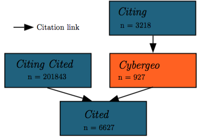
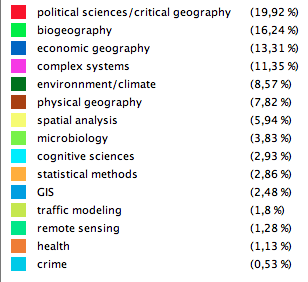

## User guide

### Description

This tab allows to explore the disciplinary neighborhood of cybergeo. It combines citation data with semantic content of articles. The exploration can be at the article level or at an aggregated level with the full semantic network.

### Methodology

#### Citation Data

The citation network is constituted by articles *citing* cybergeo articles, *cited* by cybergeo articles, and citing the same articles than cybergeo (*citing cited*). Structure and number of papers is summed up by the following figure :

The data is collected from google scholar (allowing to get only citing articles, thus the particular network structure).

#### Semantic Data

For around 200000 articles of the citation network, abstracts were collected via the Mendeley API. The extraction of significant keywords (n-grams), following [Chavalarias and Cointet, 2013], allows the construction of a semantic network by co-occurrence analysis, which nodes are keywords. Community detection (Louvain algorithm), optimized on filtering parameters (hub filtering and low edge filtering), yield disciplines which are given in the following figure :

### How to use

The tab `Network Exploration` provides article-level exploration. The user can search an article in cybergeo with the datatable. Once one is selected, different informations are displayed **if available** [note that ~600 papers among 900 have citation and semantic information].

  * citation neighborhood of the selected article
  * semantic content of the selected article as a colored wordcloud (disciplines legend above), and semantic content for the neighborhood
